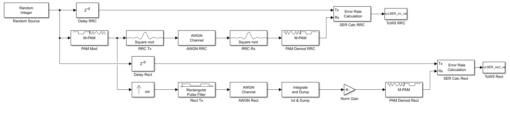

## Overview
This project involves the design and implementation of a matched filter to maximize the signal-to-noise ratio (SNR) in a communication system. The focus is on analyzing the Symbol Error Rate (SER) for Pulse Amplitude Modulation (PAM) schemes.

## Key Features
- **Matched Filter Implementation:** Designed to optimize detection in the presence of additive white Gaussian noise (AWGN).
- **Performance Analysis:** Evaluation of SER vs. SNR performance curves.
- **Simulation:** Implemented using MATLAB and Simulink to validate theoretical expectations against simulated results.

## Files
- **Report:** Detailed derivation and analysis of the matched filter and probability of error.
- **Code/Model:** MATLAB scripts and Simulink models used for the simulation.

